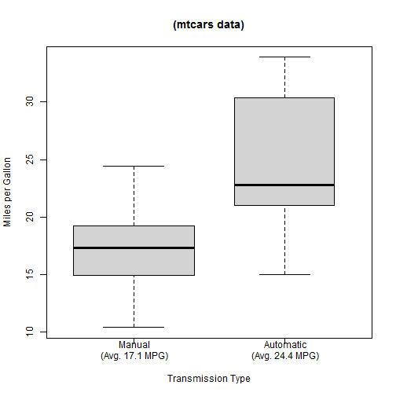

# The Effect of Transmission Type on Fuel Efficiency

## Executive Summary
This analysis addresses whether an automatic or manual transmission is better for MPG. It attempts to quantify the MPG difference between automatic and manual transmissions.

This analysis finds:

* Sample vehicles with automatic transmissions were more fuel efficient than those with manual transmissions

* At a first approximation (without controlling for any other variables), Automatic transmissions add 7.3 MPG over Manual transmissions

* Controlling for number of carburateurs, whether the engine is a V-shape, and country of manufacture, Automatic transmissions add an extra 5.8 MPG, with a 95% confidence interval of 2.4 to 9.2 MPG

---
##  Data Processing 
The data consists of 32 observations from the mtcars dataset within the R package datasets. The mtcars documentation states the data "was extracted from the 1974 Motor Trend US magazine, and comprises fuel consumption and 10 aspects of automobile design and performance for 32 automobiles (1973-74 models)." Figure 1 in the Appendix lists the variables.

---
##  Data Transformations
The sole transformation was to add a variable, country, which grouped cars by country of manufacture. The models were grouped as:

  * Sweden: Volvo 142E

  * England: Lotus Europa

  * Italy: Fiat 128, Fiat X1-9, Ferrari Dino, Maserati Bora

  * Japan: Mazda RX4,Mazda RX4 Wag,Datsun 710,Honda Civic, Toyota Corolla,Toyota Corona

  * Germany: Merc 240D, Merc 230, Merc 280, Merc 280C, Merc 450SE, Merc 450SL, Merc 450SLC, Porsche 914-2

  * USA: Hornet 4 Drive, Hornet Sportabout, Valiant, Duster 360, Cadillac Fleetwood, Lincoln Continental, Chrysler Imperial, Dodge Challenger, AMC Javelin, Camaro Z28, Pontiac Firebird, Ford Pantera L
  
---
##  Exploratory Data Analysis
Figure 2 in the Appendix illustrates the motivation for this analysis. The figure depicts boxplots of MPG, grouped by transmission type. The entire inter-quartile distribution for Automatic is above that for Manual. The mean mpg for the groups are 17.1 and 24.4, respectively. At a crude level, this implies the effect of Automatic transmission is to increase mpg by 7.3 mpg.

As we will see, this estimate is too crude. Several other variables are correlated with mpg and with each other. Weight (wt) is an important confounder. It has the largest (negative) correlation with mpg, -.87, and it is also highly correlated with several variables.

Figure 2 depicts a correlation matrix of the variables. At a glance it is apparent that several variables appear promising at explaining mpg.

---
## Discussion
The variable weight (wt) is a significant confounder. Whether the am variable was significant was largely influenced by whether wt was in the model. In models including the wt variable, the am variable tended not to be significant.

# Appendix
---
### Figure 1. Data variables in mtcars data

```
##  [1] "mpg"  "cyl"  "disp" "hp"   "drat" "wt"   "qsec" "vs"   "am"   "gear"
## [11] "carb"
```

---
### Figure 2. Miles per Gallon vs. Transmission Type
 

---
### Figure 3. Correlation Matrix
 

---
### Figure 4. Multiple Regression using all variables: Summary

```
## 
## Call:
## lm(formula = mpg ~ ., data = mtcars)
## 
## Residuals:
##    Min     1Q Median     3Q    Max 
##  -3.45  -1.60  -0.12   1.22   4.63 
## 
## Coefficients:
##             Estimate Std. Error t value Pr(>|t|)  
## (Intercept)  12.3034    18.7179    0.66    0.518  
## cyl          -0.1114     1.0450   -0.11    0.916  
## disp          0.0133     0.0179    0.75    0.463  
## hp           -0.0215     0.0218   -0.99    0.335  
## drat          0.7871     1.6354    0.48    0.635  
## wt           -3.7153     1.8944   -1.96    0.063 .
## qsec          0.8210     0.7308    1.12    0.274  
## vs            0.3178     2.1045    0.15    0.881  
## am            2.5202     2.0567    1.23    0.234  
## gear          0.6554     1.4933    0.44    0.665  
## carb         -0.1994     0.8288   -0.24    0.812  
## ---
## Signif. codes:  0 '***' 0.001 '**' 0.01 '*' 0.05 '.' 0.1 ' ' 1
## 
## Residual standard error: 2.65 on 21 degrees of freedom
## Multiple R-squared:  0.869,	Adjusted R-squared:  0.807 
## F-statistic: 13.9 on 10 and 21 DF,  p-value: 3.79e-07
```

### Figure 5. Fit Analysis, Multiple Regression using All Variables
 

---
### Figure 6. Variance Inflation Factors, All Variables

```
##    cyl   disp     hp   drat     wt   qsec     vs     am   gear   carb 
## 15.374 21.620  9.832  3.375 15.165  7.528  4.966  4.648  5.357  7.909
```

---
